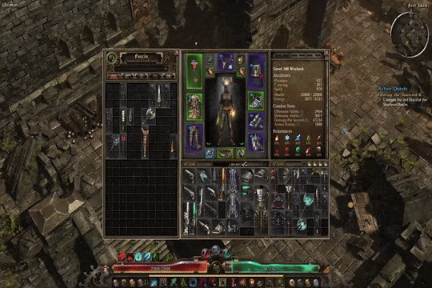

# Introduction

Written in Python, this tool generates an executable that assists with inventory management in Grim Dawn. It uses specific screen coordinates to interact with inventory cells, simulate right-click actions, and more.



# Features

- **Automated Inventory Management:**  
  Quickly sell or dismantle every item in the inventory with a single key press.

- **System Tray Integration:**  
  A tray icon provides a right-click "Exit" option to easily terminate the app.

- **Configurable Behavior:**  
  Uses a configuration file (`config.ini`) to store constants such as inventory dimensions and keyboard shortcuts.

# Usage

The application utilizes the following hotkeys:

- **F1** – Sell all items in the **Main Inventory** while an NPC window is open.
  - Iterates over each cell in the main inventory and simulates right click
- **F2** – Sell all items in the **Secondary Inventory** while an NPC window is open.
  - Iterates over each cell in the active secondary inventory and simulates right click 
- **F3** – Dismantle all items in the **Main Inventory** while the Inventor window is open.
  - Iterates over each cell in the main inventory and simulates a series of clicks to dismantle. 
- **F4** – Dismantle all items in the **Secondary Inventory** while the Inventor window is open.
  - Iterates over each cell in the main inventory and simulates a series of clicks to dismantle.  

# Installation

> **Note:** The coordinates used in this application are written for a 1920x1080 screen resolution with the default UI scale. Adjustments will be needed for different screen resolutions or UI scaling settings.

[Download latest version from Releases](https://github.com/MustafaErvaErgul/GD-Tools/releases)

# Configuration

As previously mentioned, the config.ini file contains coordinates that are very important for the program to work properly. You will need to adjust the values in the config.ini for your setup if you are not using 1920x1080 resolution with the default UI scale. Here is what the config file looks like 

```
[Shortcuts]
SELL_MAIN_BAG = F1
SELL_SECONDARY_BAG = F2
DISMANTLE_MAIN_BAG = F3
DISMANTLE_SECONDARY_BAG = F4
EXIT_EARLY = F10

[Constants]
DEBUG = False

MOUSEEVENTF_RIGHTDOWN = 0x0008
MOUSEEVENTF_RIGHTUP = 0x0010
MOUSEEVENTF_LEFTDOWN = 0x0002
MOUSEEVENTF_LEFTUP = 0x0004

SHORT_DELAY = 0.01
MEDIUM_DELAY = 0.1
LONG_DELAY = 1

INVENTORY_CELL_SIDE_LENGTH = 30
INVENTORY_CELL_BORDER_LENGTH = 1
MAIN_INVENTORY_ROW_COUNT = 8
MAIN_INVENTORY_COL_COUNT = 12
SECONDARY_INVENTORY_ROW_COUNT = 8
SECONDARY_INVENTORY_COL_COUNT = 8

COORDINATES_MAIN_INVENTORY_FIRST_CELL = 825, 645
COORDINATES_SECONDARY_INVENTORY_FIRST_CELL = 1215, 645

COORDINATES_INVENTOR_TRANSMUTE_TAB = 730, 270
COORDINATES_INVENTOR_DISMANTLE_TAB = 630, 270
COORDINATES_INVENTOR_ITEM_PLACEMENT_SPOT = 630, 520
COORDINATES_INVENTOR_DISMANTLE_BUTTON = 630, 840
COORDINATES_INVENTOR_DISMANTLE_CONFIRM_BUTTON = 830, 600
```

# Packaging the application yourself

Ensure you have Python installed (version 3.6+ recommended). You will also need the following non-native Python packages:

- **PyInstaller** – for packaging the app into a single executable.
- **keyboard** – for capturing and handling key press events.
- **ConfigParser** – for reading configuration files (this is included in Python’s standard library as `configparser`).
- **Pillow (PIL)** – for image processing, required by the tray icon.
- **pystray** – for creating the system tray icon.

```
pip install pyinstaller keyboard pillow pystray
```

To package the application
```
.\package.bat
```
